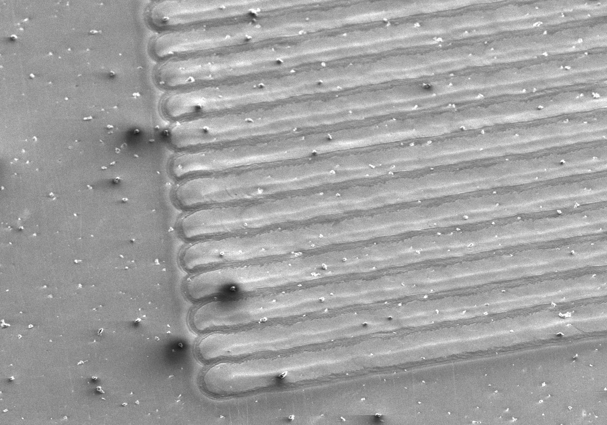
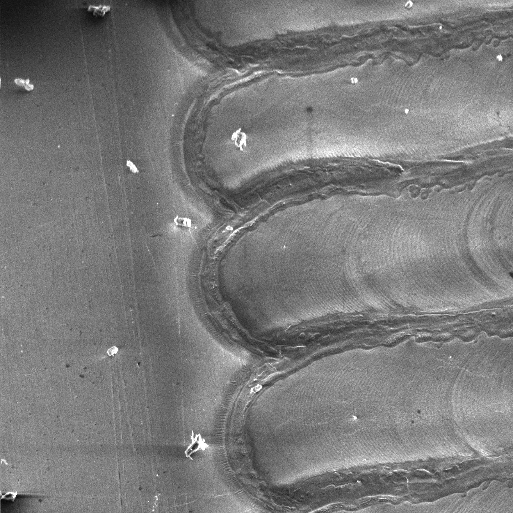

# MOPA_Laser_Diffraction_Gratings
Machine settings, photos of material test swatches, and code to generate diffraction patterns on stainless steel with a MOPA fiber laser.  By moving the laser spot at 300mm/s, and pulsing at 300KHz, it is possible to make a diffractive pattern with 1 micron pitch on stainless steel sheets.  The grating direction is formed perpendicularly to the direction of laser travel.

I used a Cloudray GM100 MOPA laser engraver with 290mm focal length F-theta lens :  https://www.cloudraylaser.com/products/cloudray-gm-100-litemarker-100w-fiber-laser-marking-engraver-with-4-3-x-4-3-scan-area?variant=43545779830945

The easiest way to get started making your own designs in [Lightburn](https://lightburnsoftware.com/):  Import an svg file, and Use the "fill" or "offset fill", 300 mm/s,  300KHz,  19% power,  60ns pulse width, .05mm line interval.

All substrates are polished stainless steel. .048"  (1.2mm) is great because it doesn't warp much.  .036" (0.9mm) is acceptable, but thinner metal has a lot of problems with warping.   https://www.mcmaster.com/9785K12/   https://www.mcmaster.com/9785K13/     I used a vacuum chuck to hold the sheet metal flat while engraving:  https://www.ebay.com/itm/276754053418  https://www.clampusystems.com/product-category/vacuum-tables/sg-vacuum-table-series/

#Folders in this repo:

**grayscale_to_svg:**  Input a grayscale image where each pixel value will be translated to a diffraction grating angle.  0=0* 127=90* 255 = 180*     These angles will be saved to an svg, with "pixels" that are filled with lines at the specified angle.  The line spacing and pixel size are adjustable.  The overall effect is to make a brilliant colorful image that shimmers as the lighting angle is changed.

**color_image_to_svg:**  Input a color image, and map the colors to grating spacing, such that a correct color image will be produced at one particular lighting and viewing angle.  This script also accepts a correction gradient to account for changes in viewing angle from the top to the bottom of the image.  To use this, first run color_to_grating_pitch.  Then run angle_and_pitch_to_svg

**depthmap_to_parallax:**  Input a grayscale image, where each pixel value represents its distance from the surface of the "hologram".  0 = far in the distance   127 = at the hologram plane   254 = far in front of the hologram.  255 = don't process.  Following this, use the grayscale_to_svg script.

**hologram_experiments:**  Several scripts to raytrace a scene, and attempt to make a Benton (rainbow) hologram computationally.  Work in progress.

Optimize travel speed and frequency for 60ns pulse .045mm line spacing and 19.6% power.

Optimize travel speed and frequency for 60ns pulse .06mm line spacing and 19.6% power.

Optimize travel speed and frequency for 45ns pulse .06mm line spacing and 19.6% power.

This electron microscope view of a series of .06mm spaced lines shows the start point and heat affected zone from overlapping lines.

A close view with the electron microscope shows the pattern created by the laser pulses with 1 micron spacing.  The pattern has almost no surface height variation, rather it seems to be an oxide layer that provides enough index change to make the grating function.

Optimize power and line spacing for 100ns pulse at 300KHz.  19% power and .06mm spacing provides good quality with minimum heat input.  Higher power and smaller interval work, but put more heat into the piece and may cause warping.

Optimize power and line spacing for 80ns pulse at 300KHz.  19% power and .06mm spacing provides good quality with minimum heat input.  Higher power and smaller interval work, but put more heat into the piece and may cause warping.

Optimize power and line spacing for 60ns pulse at 300KHz.  19% power and .06mm spacing provides good quality with minimum heat input.  Higher power and smaller interval work, but put more heat into the piece and may cause warping.

Optimize power and line spacing for 45ns pulse at 300KHz.  19% power and .06mm spacing provides good quality with minimum heat input.  Higher power and smaller interval work, but put more heat into the piece and may cause warping.

Optimize power and line spacing for 30ns pulse at 300KHz.  19% power and .06mm spacing provides good quality with minimum heat input.  Higher power and smaller interval work, but put more heat into the piece and may cause warping.

Optimize power and line spacing for 45ns pulse at 300KHz.  Higher power range.  Above 22%, even at 45ns pulse length, the diffractive pattern becomes less clear due to excessive heat input into the material.

