# MOPA_Laser_Diffraction_Gratings
Machine settings, photos of material test swatches, and code to generate diffraction patterns on stainless steel with a MOPA fiber laser

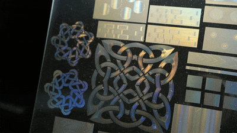

I used a Cloudray GM100 MOPA laser engraver with 290mm focal length F-theta lens :  https://www.cloudraylaser.com/products/cloudray-gm-100-litemarker-100w-fiber-laser-marking-engraver-with-4-3-x-4-3-scan-area?variant=43545779830945
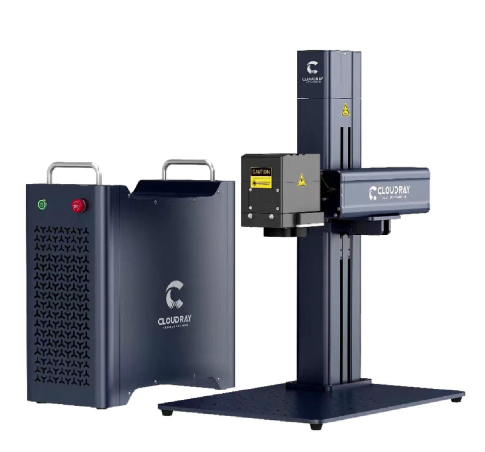

All substrates are polished stainless steel. .048"  (1.2mm) is great because it doesn't warp much at all.  .036" (0.9mm) is acceptable, but thinner metal has a lot of problems with warping.   https://www.mcmaster.com/9785K12/   https://www.mcmaster.com/9785K13/   

Optimize travel speed and frequency for 60ns pulse .045mm line spacing and 19.6% power.
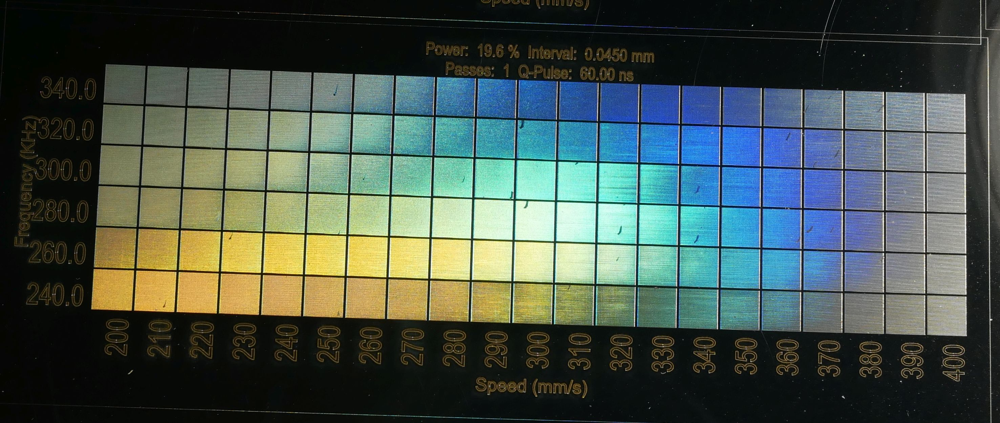

Optimize travel speed and frequency for 60ns pulse .06mm line spacing and 19.6% power.
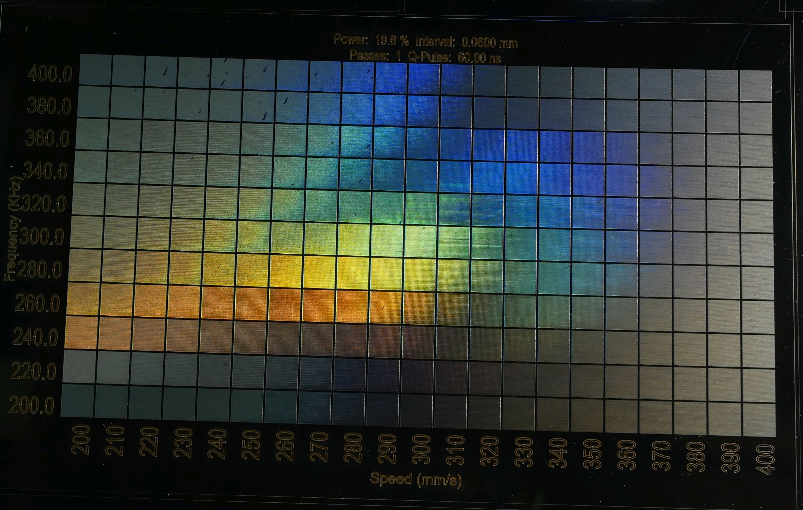

Optimize travel speed and frequency for 45ns pulse .06mm line spacing and 19.6% power.
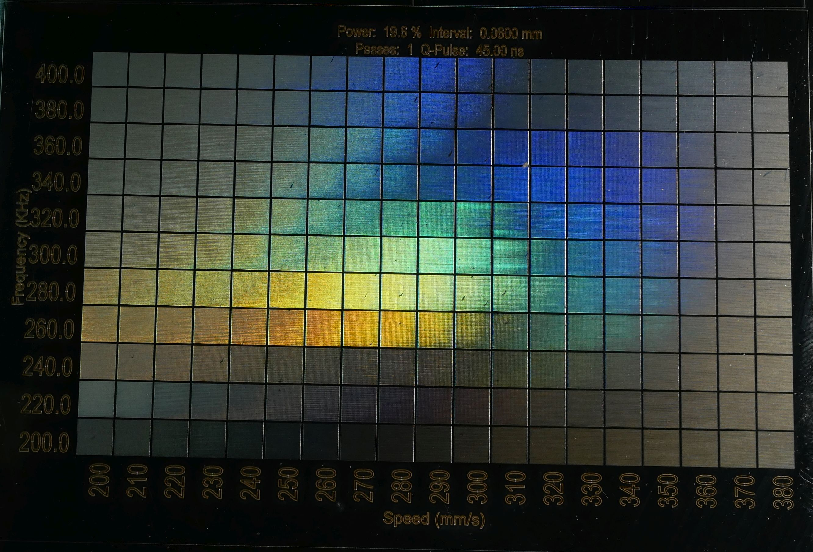

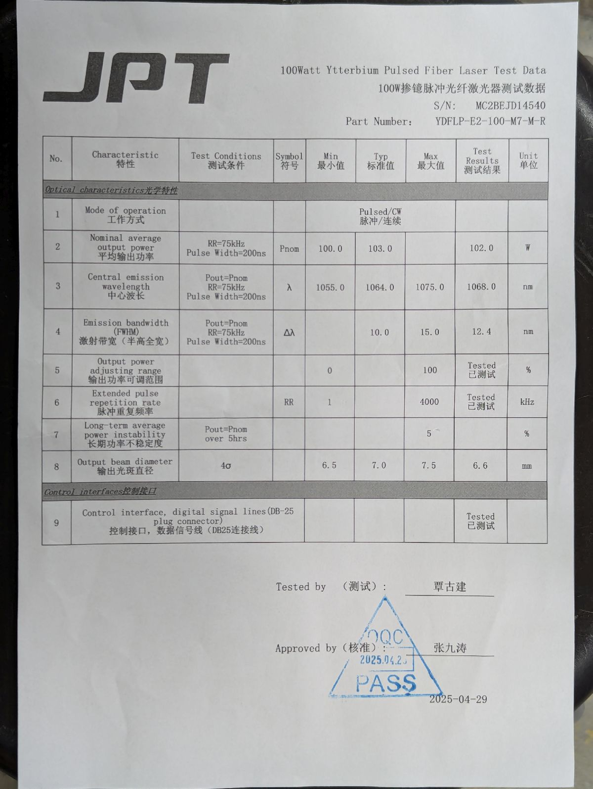

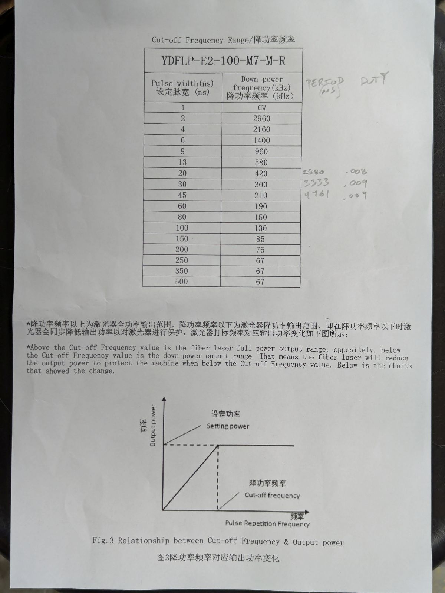

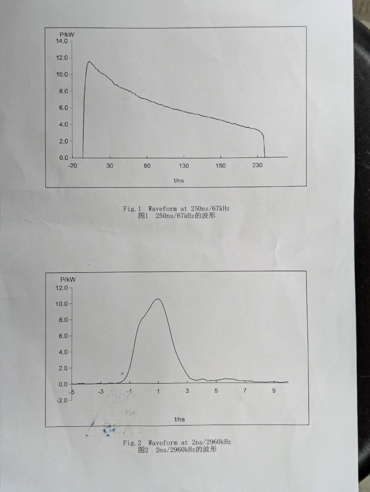

Optimize power and line spacing for 100ns pulse at 300KHz.  19% power and .06mm spacing provides good quality with minimum heat input.  Higher power and smaller interval work, but put more heat into the piece and may cause warping.
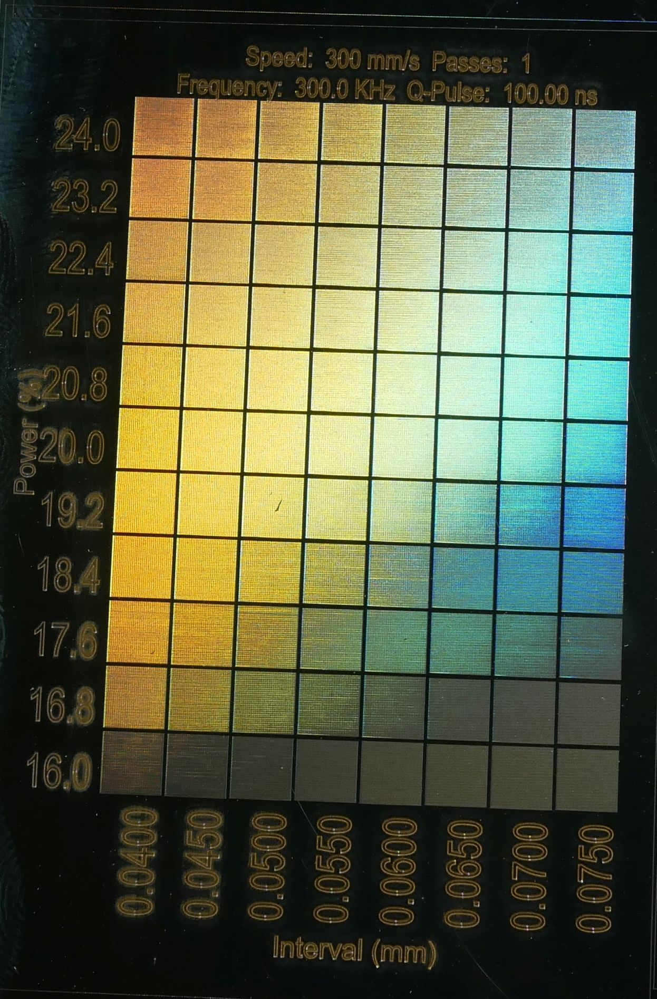

Optimize power and line spacing for 80ns pulse at 300KHz.  19% power and .06mm spacing provides good quality with minimum heat input.  Higher power and smaller interval work, but put more heat into the piece and may cause warping.
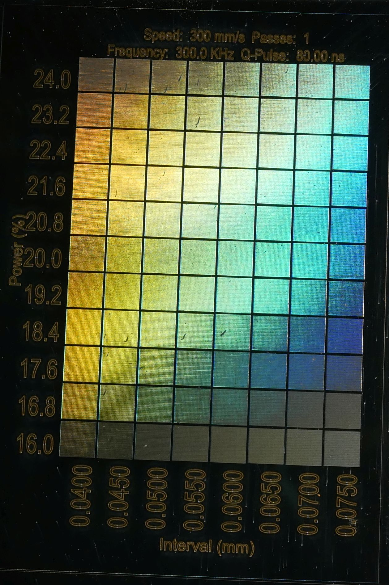

Optimize power and line spacing for 60ns pulse at 300KHz.  19% power and .06mm spacing provides good quality with minimum heat input.  Higher power and smaller interval work, but put more heat into the piece and may cause warping.
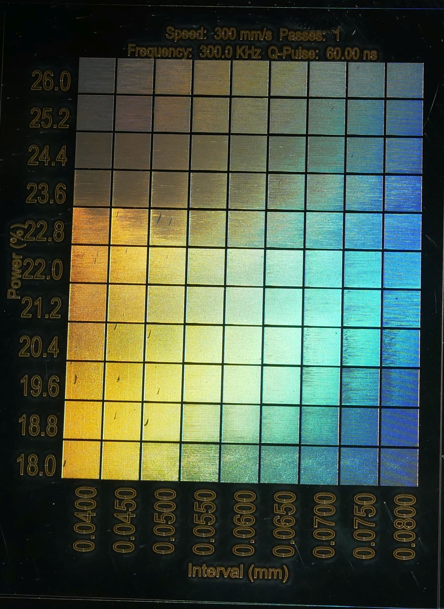

Optimize power and line spacing for 45ns pulse at 300KHz.  19% power and .06mm spacing provides good quality with minimum heat input.  Higher power and smaller interval work, but put more heat into the piece and may cause warping.
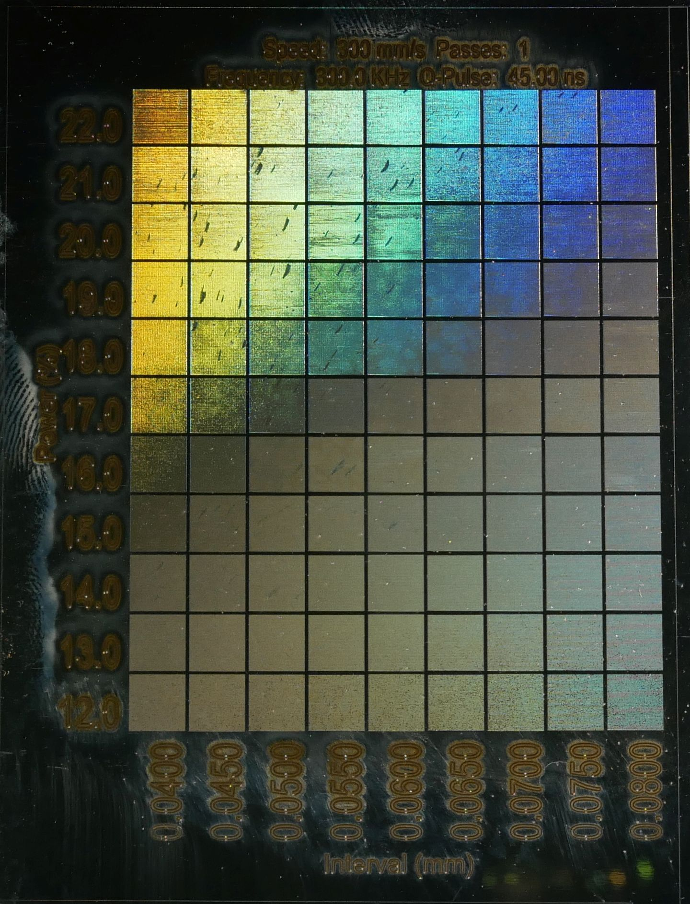

Optimize power and line spacing for 30ns pulse at 300KHz.  19% power and .06mm spacing provides good quality with minimum heat input.  Higher power and smaller interval work, but put more heat into the piece and may cause warping.
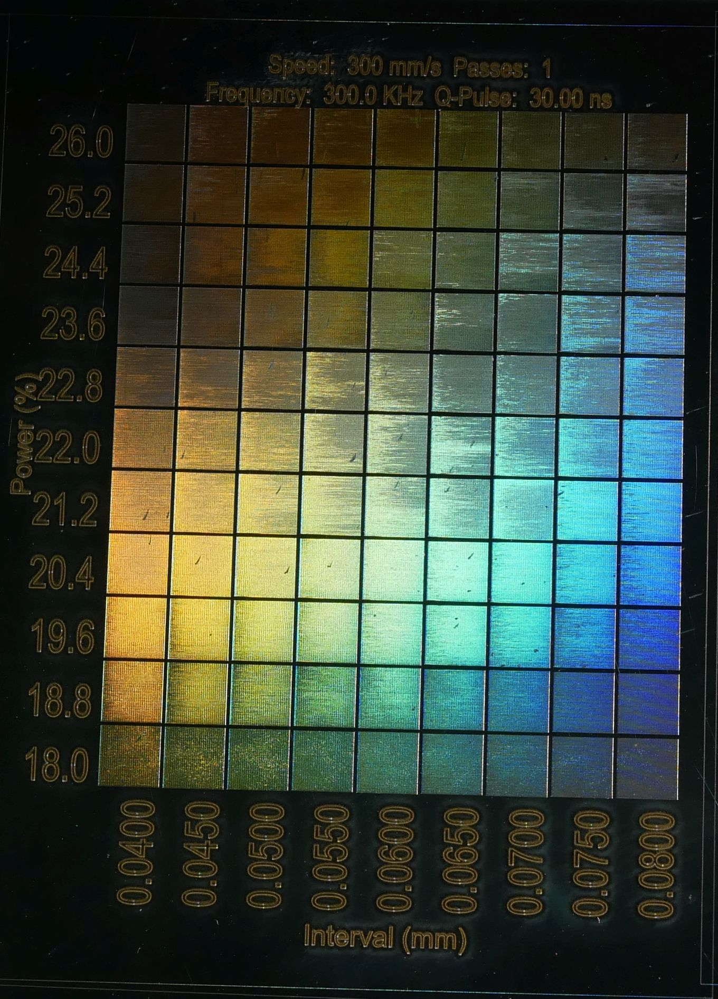

Optimize power and line spacing for 45ns pulse at 300KHz.  Higher power range.  Above 22%, even at 45ns pulse length, the diffractive pattern becomes less clear due to excessive heat input into the material.
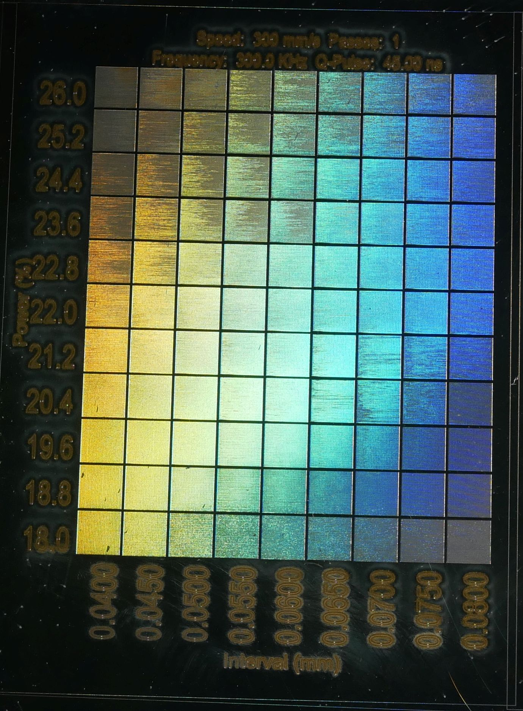

